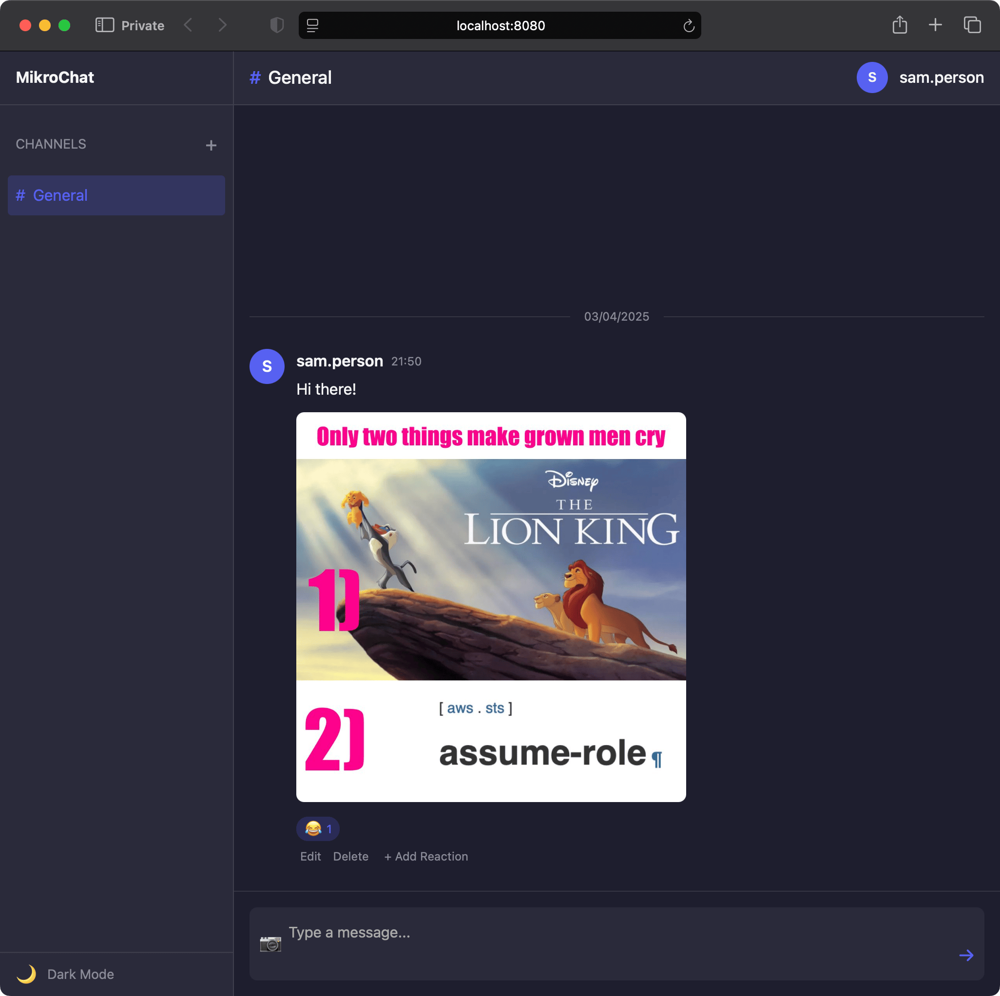
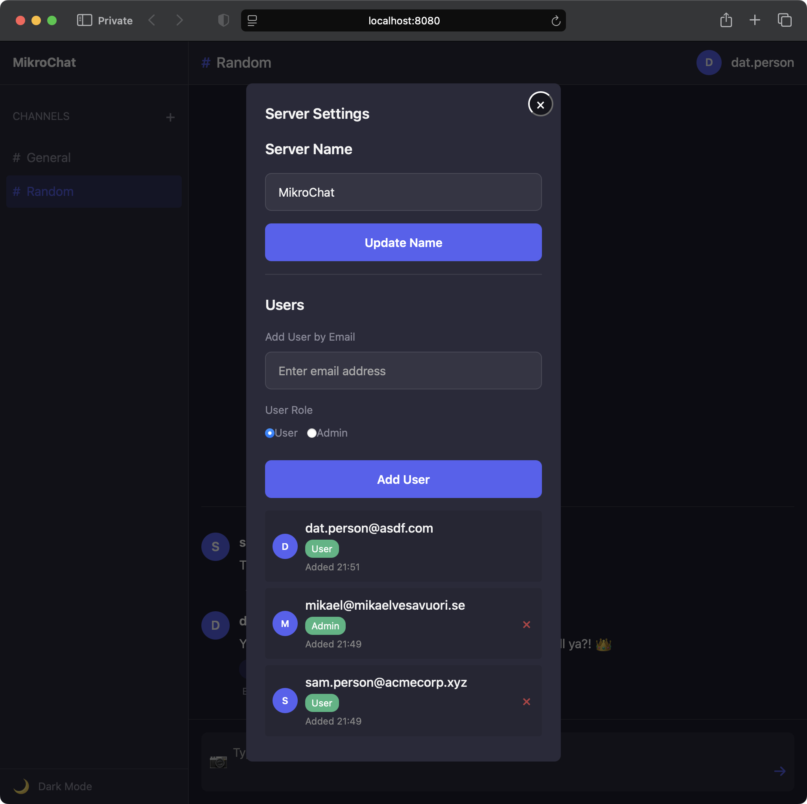
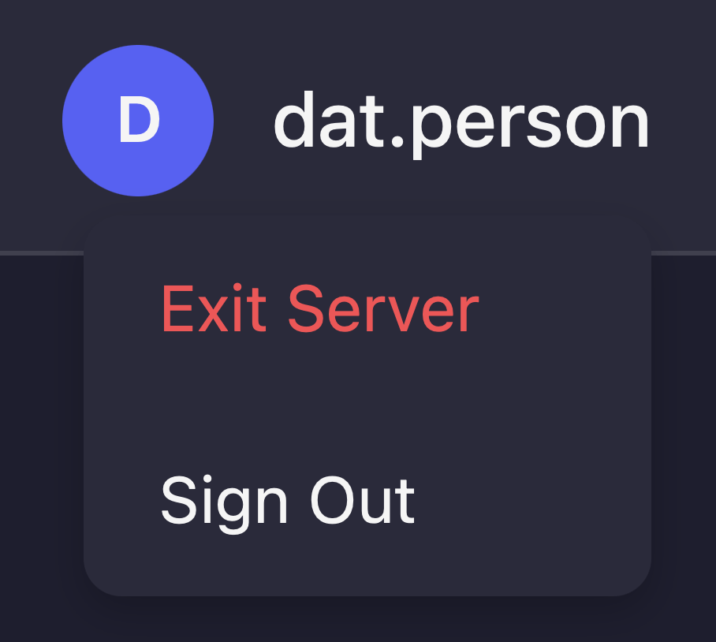

# MikroChat

**The minimalist chat app that's all yours**.

MikroChat is a minimalistic, back-to-basics, and complete chat application for those tired of expensive bills, vendor lock-in, and distractions.


[](https://opensource.org/licenses/MIT)

---

- Batteries included - no need for anything beyond MikroChat
  - The codebase includes both the web application code and the server/API part
- Supports text and image messages
- Emoji reactions included
- Dark mode for the hackers
- Channels for all your memes, projects, and "important discussions"
- In-app notifications for unread messages in channels
- "Dev mode" sign-in or full-on magic link authentication
  - Possible to configure whether or not users must be invited before signing in
- The web app is a simple, installable Progressive Web App (PWA)
- Server can be packaged as a single compiled JS file
- Lightweight:
  - Just four dependencies on the backend: [MikroAuth](https://github.com/mikaelvesavuori/mikroauth), [MikroConf](https://github.com/mikaelvesavuori/mikroconf), [MikroDB](https://github.com/mikaelvesavuori/mikrodb), and [MikroServe](https://github.com/mikaelvesavuori/mikroserve)
  - A single additional library used on the frontend: [MikroSafe](https://github.com/mikaelvesavuori/mikrosafe)



## Installation

Clone the repo or download your version of choice from the releases page.

## Quick Start

MikroChat comes ready out of the box to work locally.

The first thing to do is have a configuration ready. Rename `mikrochat.config.example.json` to `mikrochat.config.json`. It should look similar to this:

```json
{
  "devMode": true,
  "auth": {
    "jwtSecret": "my-secret-super-random-key",
    "appUrl": "http://localhost:8080",
    "isInviteRequired": false
  },
  "chat": {
    "initialUser": {
      "userName": "you",
      "email": "you@yourdomain.com"
    }
  },
  "email": {
    "user": "email_user",
    "host": "smtp.emailprovider.com",
    "password": "something"
  },
  "server": {
    "allowedDomains": [
      "*"
    ]
  }
}
```

Make sure to edit the initial user information!

This is the minimum needed to get started plus a few knobs you may want to steer, such as if an invite is required before joining a server.

**Note that even if you are not using magic link authentication, you must supply non-empty values (it's OK if these are made-up)**.

Next, boot up two terminals.

- In the first, run `npm run dev` to start the web app file server. The only thing it does is serve files, it doesn't build it anything. You won't need to restart that one at all - just let it run. The frontend will run on `http://localhost:8080`.
- In the second terminal, start the backend with `npm run dev:reload`. This sets up a dev loop which rebuilds the web app JS and fires up the backend so the web app can make requests. It will run on `http://localhost:3000`.

**Note that there's no hot reloading**. If you make changes to the web app (frontend) then you need to re-run the `npm run dev:reload` command. Any time this command is run, the compiled web app JS is put in the `app` directory, so that it's available for serving. Don't actually make any changes to `mikrochat.min.js` in that folder, though!

You can now log in to MikroChat on `http://localhost:8080`.

## Design

### Design Goals

Broadly the idea has been to emulate the most pertinent features of chat applications like Slack and Discord: Text messages, image support, emoji reaction, the ability to create channels, manage users, and such.

The big idea is to provide the lowest-common denominator chat application that is functionally complete, looks good, and behaves like you need it to.

Anytime you are building something that already exists, there's also a great opportunity to look at what _not_ to do, so there are several things that I did not want to support:

- **No direct messages**: Direct messages are anathema to open and transparent communication. [This article](https://www.linkedin.com/pulse/use-channels-direct-messages-andrzej-krzywda/) is a good introduction to that notion.
- **No threads**: In the spirit of simplicity and keeping to linear dialogues, threading becomes an anti-pattern. At some point other types of discussions become better than texting.
- **Short history** (_but make the brevity configurable_): Apps like Slack are useless for actual, qualitative documentation, yet many seem to use it like that. A short history ensures that it becomes infeasible to do so. Also, MikroChat and related apps are for discussions, not decisions! Use the right tool for the job.

## Technology

The tech is refreshingly uncomplicated.

### Web App

There is a web app—using plain vanilla HTML, CSS, and (M)JS—with the files residing in the `app` directory. This controls the UI, state, interactions, etc.

In MikroChat, the (M)JS is built the "old way" where code is assembled into a flat file where everything is effectively global. That's why you won't import or export anything in the files - instead expect e.g. functions declared in one file to be available in others.

For PWA functionality, there is a manifest file, a service worker, and a script to register it.

All output is optimized using [esbuild](https://esbuild.github.io), [html-minifier-terser](https://www.npmjs.com/package/html-minifier-terser), and [lightningcss](https://lightningcss.dev).

### API

There's also a server (or API), written in TypeScript. It's in the `src` directory. The backend takes care of persistence, authentication, and such.

This code gets optimized and bundled with [esbuild](https://esbuild.github.io).

### Realtime Communication

Realtime communication is handled using [Server Sent Events](https://developer.mozilla.org/en-US/docs/Web/API/Server-sent_events).

The backend will ensure that a user has at most three connections at any time.

The server is set to allow unlimited connections. To change this value you will have to make changes to `app/Server.ts`; it's not configurable any other way currently.

---

## How-To and Questions

### What is the Initial User?

Every MikroChat server has a first Admin user who is created when the server is first created - this is the "initial user".

### Inviting or Removing Users

Inviting users (email addresses) is done by clicking the server name and filling out the needed information.

Only Admin users can remove others. They are instantly signed out.



### Change the Server Name

Done in the Settings view as shown above.

### Sign Out or Leave (Exit) a Server

Both of these actions are done on the button with your user name.

Exiting a server is only possible if you are not the last remaining Admin.



---

## Configuration

Settings can be provided in multiple ways.

- They can be provided via the CLI, e.g. `node app.js --port 1234`.
- Certain values can be provided via environment variables.
  - Port: `process.env.PORT` - number
  - Host: `process.env.HOST` - string
  - Debug: `process.env.DEBUG` - boolean
- Programmatically/directly via scripting, e.g. `new MikroAuth({ port: 1234 })`.
- They can be placed in a configuration file named `mikroauth.config.json` (plain JSON), which will be automatically applied on load.

### Options

| CLI argument                | CLI value                                                     | JSON (config file) value           | Environment variable |
|-----------------------------|---------------------------------------------------------------|------------------------------------|----------------------|
| --messageRetentionDays      | `<number>`                                                    | chat.messageRetentionDays          |                      |
| --maxMessagesPerChannel     | `<number>`                                                    | chat.maxMessagesPerChannel         |                      |
| --initialUserId             | `<string>`                                                    | chat.initialUser.id                | INITIAL_USER_ID      |
| --initialUserName           | `<string>`                                                    | chat.initialUser.userName          | INITIAL_USER_NAME    |
| --initialUserEmail          | `<string>`                                                    | chat.initialUser.email             | INITIAL_USER_EMAIL   |
| --jwtSecret                 | `<string>`                                                    | auth.jwtSecret                     | AUTH_JWT_SECRET      |
| --magicLinkExpirySeconds    | `<number>`                                                    | auth.magicLinkExpirySeconds        |                      |
| --jwtExpirySeconds          | `<number>`                                                    | auth.jwtExpirySeconds              |                      |
| --refreshTokenExpirySeconds | `<number>`                                                    | auth.refreshTokenExpirySeconds     |                      |
| --maxActiveSessions         | `<number>`                                                    | auth.maxActiveSessions             |                      |
|                             | (object with functions in JSON config)                        | auth.templates                     |                      |
| --appUrl                    | `<string>`                                                    | auth.appUrl                        | APP_URL              |
| --debug                     | none (is flag)                                                | auth.debug                         | DEBUG                |
| --emailSubject              | `<string>`                                                    | email.emailSubject                 |                      |
| --emailHost                 | `<string>`                                                    | email.user                         | EMAIL_USER           |
| --emailUser                 | `<string>`                                                    | email.host                         | EMAIL_HOST           |
| --emailPassword             | `<string>`                                                    | email.password                     | EMAIL_PASSWORD       |
| --emailPort                 | `<number>`                                                    | email.port                         |                      |
| --emailSecure               | none (is flag)                                                | email.secure                       |                      |
| --emailMaxRetries           | `<number>`                                                    | email.maxRetries                   |                      |
| --debug                     | none (is flag)                                                | email.debug                        | DEBUG                |
| --dir                       | `<string>`                                                    | storage.databaseDirectory          |                      |
| --encryptionKey             | `<string>`                                                    | storage.encryptionKey              | STORAGE_KEY          |
| --debug                     | none (is flag)                                                | storage.debug                      | DEBUG                |
| --port                      | `<number>`                                                    | server.port                        | PORT                 |
| --host                      | `<string>`                                                    | server.host                        | HOST                 |
| --https                     | none (is flag)                                                | server.useHttps                    |                      |
| --http2                     | none (is flag)                                                | server.useHttp2                    |                      |
| --cert                      | `<string>`                                                    | server.sslCert                     |                      |
| --key                       | `<string>`                                                    | server.sslKey                      |                      |
| --ca                        | `<string>`                                                    | server.sslCa                       |                      |
| --ratelimit                 | none (is flag)                                                | server.rateLimit.enabled           |                      |
| --rps                       | `<number>`                                                    | server.rateLimit.requestsPerMinute |                      |
| --allowed                   | `<comma-separated strings>` (array of strings in JSON config) | server.allowedDomains              |                      |
| --debug                     | none (is flag)                                                | server.debug                       | DEBUG                |

_Setting debug mode in CLI arguments will enable debug mode across all areas. To granularly define this, use a config file._

### Order of Application

As per [MikroConf](https://github.com/mikaelvesavuori/mikroconf) behavior, the configuration sources are applied in this order:

1. Command line arguments (highest priority)
2. Programmatically provided config
3. Config file (JSON)
4. Default values (lowest priority)

### Magic Link Configuration

Defaults shown and explained.

```typescript
{
  // The base URL to use in the magic link, before appending "?token=TOKEN_VALUE&email=EMAIL_ADDRESS"
  appUrl: 'https://acmecorp.xyz/app',
  // Your secret JWT signing key
  jwtSecret:  'your-secret-signing-key-for-jwts',
  // Time until magic link expires (15 min)
  magicLinkExpirySeconds: 15 * 60,
  // Time until JWT expires (60 minutes)
  jwtExpirySeconds: 60 * 60,
  // Time until refresh token expires (7 days)
  refreshTokenExpirySeconds: 7 * 24 * 60 * 60,
  // How many active sessions can a user have?
  maxActiveSessions: 3,
  // Custom email templates to use
  templates: null,
  // Use debug mode?
  debug: false
}
```

Templates are passed in as an object with a function each to create the text and HTML versions of the magic link email.

```typescript
{
  // ...
  templates: {
    textVersion: (magicLink: string, expiryMinutes: number) =>
      `Sign in to your service. Go to ${magicLink} — the link expires in ${expiryMinutes} minutes.`,
    htmlVersion: (magicLink: string, expiryMinutes: number) =>
      `<h1>Sign in to your service</h1><p>Go to ${magicLink} — the link expires in ${expiryMinutes} minutes.</p>`
  }
}
```

### Email Configuration

Defaults shown and explained.

```typescript
{
  // The subject line for the email
  emailSubject: 'Your Secure Login Link',
  // The user identity sending the email from your email provider
  user: process.env.EMAIL_USER || '',
  // The SMTP host of your email provider
  host: process.env.EMAIL_HOST || '',
  // The password for the user identity
  password: process.env.EMAIL_PASSWORD || '',
  // The port to use (465 is default for "secure")
  port: 465,
  // If true, sets port to 465
  secure: true,
  // How many deliveries will be attempted?
  maxRetries: 2,
  // Use debug mode?
  debug: false
}
```

See [MikroMail](https://github.com/mikaelvesavuori/mikromail) for more details.

### Authentication Modes

The following are the possible modes to set in the web application via `app/scripts/config.mjs`.

#### Dev Mode

The `dev` mode is a barebones option that allows anyone to sign in to the MikroChat server using an email address.

**Note that this setting must be complemented by a similar change on the server or this will not work.**

#### Magic Link

The `magic-link` mode will make the web application behave appropriately for using passwordless magic links as the sign-in method. The implementation expects [MikroAuth](https://github.com/mikaelvesavuori/mikroauth) to be used.

### Require Users To Be Invited Before Signing In

You can decide if a user can self-signup to your chat server or not. This is configured on `auth.isInviteRequired` which by default is set to `true`.

Inviting users (email addresses) is done by clicking the server name and filling out the needed information.

## Server Mode

MikroChat has built-in functionality to be exposed directly as a server or API using [MikroServe](https://github.com/mikaelvesavuori/mikroserve).

This is what happens when you run `npm start` or run the compiled, deployable JS file (see the [Deployment](#deployment) section)

- JSON-based request and response format
- Configurable server options
- Support for both HTTP, HTTPS, and HTTP2
- Graceful shutdown handling

### Server Configuration

Configuring the server (API) settings follows the conventions of [MikroServe](https://github.com/mikaelvesavuori/mikroserve); please see that documentation for more details. In short, in this case, you can supply configuration in several ways:

- Configuration file, named `mikrochat.config.json`
- CLI arguments
- Environment variables

#### HTTPS/HTTP2 Configuration

To enable HTTPS or HTTP2, provide the following options when starting the server:

```javascript
const server = startServer({
  useHttps: true,
  // OR
  useHttp2: true,
  sslCert: '/path/to/certificate.pem',
  sslKey: '/path/to/private-key.pem',
  sslCa: '/path/to/ca-certificate.pem' // Optional
});
```

#### Generating Self-Signed Certificates (for testing)

```bash
# Generate a private key
openssl genrsa -out private-key.pem 2048

# Generate a certificate signing request
openssl req -new -key private-key.pem -out csr.pem

# Generate a self-signed certificate (valid for 365 days)
openssl x509 -req -days 365 -in csr.pem -signkey private-key.pem -out certificate.pem
```

## Development

More commands are available to see in `package.json`.

### Start (API)

```bash
npm start
```

### Start (Web App)

```bash
npm run dev
```

### Build

```bash
npm run build
```

### Notes

Because you are dealing with caching, service workers, and persisted data, you may want to clear out things that have gone stale or break as you develop. A few things you might want to do:

- Wipe the MikroDB data: On the CLI, run `rm -rf mikrochat_db` (default name)
- Clear service workers: In your web console, run `navigator.serviceWorker.getRegistrations().then(rs => rs.forEach(r => r.unregister())).catch(err => console.log('SW registration failed:', err));`
- Clear localStorage: In your web console, run `localStorage.clear()`

## Deployment

### What You Need To Host MikroChat

1. Somewhere to host the static files for the web app
2. A server to run the MikroChat backend API

Simple as that!

### Complete Build

The quick command to build everything is `npm run build`.

### API (Backend)

Ensure that you have all of the configuration settings set up as you need in `src/config/configDefaults.ts`.

Build the API with `npm run build:api`. Files will end up in the `lib` directory in both CJS and ESM formats.

Deploy this onto a server of your choice and start it with `node mikrochat.bundled.mjs` (or `.cjs`).

### Web Application (Frontend)

You'll need to set the appropriate settings in `app/scripts/config.mjs` first.

Next, build the app with `npm run build:web`. You will have a fresh set of compiled and optimized files in the `dist` directory.

The last thing to do is to deploy it to a static site host — after all, it's just a bunch of HTML, CSS, and JS!

## License

MIT. See the `LICENSE` file.
