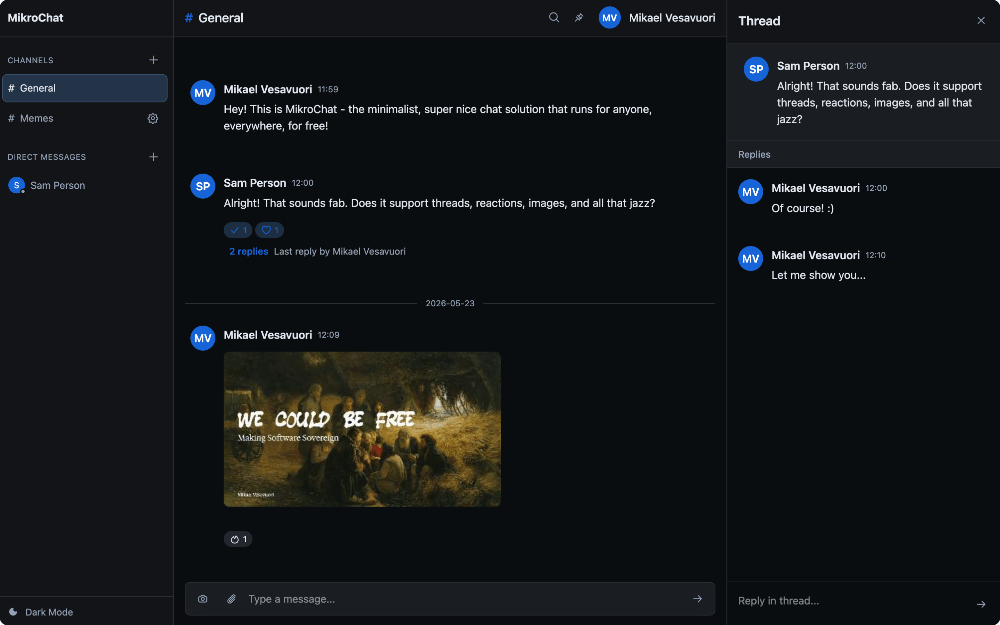

# MikroChat

**The minimalist chat app that's all yours.**



MikroChat is a self-hosted team chat application for teams who want complete control over their communication without expensive bills, vendor lock-in, or distractions.


[](https://opensource.org/licenses/MIT)

## Features

- **Batteries included** - paired frontend and backend release archives
- **Channel-based messaging** with public/private channels, text, images, and files
- **Threaded replies** on channel messages
- **Direct messages** between users
- **Search, mentions, pins, quotes, and message links** for day-to-day team workflows
- **Browser notifications, unread badges, and presence** for awareness without noise
- **Emoji reactions** on messages
- **Real-time updates** via Server-Sent Events
- **Dark mode** for the hackers
- **Optional encryption at rest** - AES-256-GCM encryption for stored server data when configured
- **Flexible auth** - dev mode, magic link, password, or OAuth 2.0
- **Webhooks** - let external services post messages to channels
- **Admin operations** - export data, review audit logs, manage users and roles
- **Lightweight** - minimal dependencies, single-file deployable backend

## Quick Start

### Download the App and API

```bash
curl -sSL -o mikrochat_app.zip https://releases.mikrosuite.com/mikrochat_app_latest.zip
curl -sSL -o mikrochat_api.zip https://releases.mikrosuite.com/mikrochat_api_latest.zip
unzip mikrochat_app.zip -d mikrochat_app
unzip mikrochat_api.zip -d mikrochat_api
```

Create a server config beside the extracted API bundle:

```bash
cd mikrochat_api/*
cp mikrochat.config.example.json mikrochat.config.json
# Edit mikrochat.config.json with your settings
node lib/mikrochat.mjs
```

Serve the extracted app bundle from any static host:

```bash
cd ../../mikrochat_app/*
npx http-server . -a 127.0.0.1 -p 8000 -c-1
```

The API runs on `http://127.0.0.1:3000`. Open `http://127.0.0.1:8000` and sign in with your configured initial user's email and authentication method.

## Configuration

MikroChat reads `mikrochat.config.json` from the working directory, then applies environment variables and CLI flags. The CLI creates a starter config with `mikrochat init`.

Common settings:

- `server.host` and `server.port` - API bind address and port
- `server.allowedDomains` - frontend origins allowed to call the API
- `auth.appUrl` - public frontend URL used by auth links
- `auth.authMode` - `dev`, `magic-link`, or `password`
- `auth.isInviteRequired` - require invited users for magic-link and password flows
- `email` - SMTP settings for magic links and password reset mail
- `oauth` - OAuth 2.0 provider settings
- `storage.databaseDirectory` - PikoDB data directory
- `storage.encryptionKey` - optional AES-256-GCM encryption key for stored server data

The browser app gets public auth and API settings from the backend at runtime through `GET /config.json`. Keep secrets in `mikrochat.config.json`, environment variables, or the server-side database.

## API

- `GET /health` returns service health
- `GET /config.json` returns public browser runtime config
- Auth routes cover login, logout, magic links, password auth, password reset, and OAuth callbacks
- Chat routes cover users, channels, messages, threads, reactions, pins, search, files, webhooks, audit logs, and admin export

See the API reference in the docs site for the full route list and payload shapes.

## Documentation

Full documentation is available at **[mikrosuite.com/chat/docs](https://mikrosuite.com/chat/docs)**:

- [Introduction](https://mikrosuite.com/chat/docs/getting-started/intro) — What is MikroChat?
- [Installation & Quickstart](https://mikrosuite.com/chat/docs/getting-started/installation) — Get up and running
- [Configuration](https://mikrosuite.com/chat/docs/guides/configuration) — All configuration options
- [Authentication](https://mikrosuite.com/chat/docs/guides/authentication) — Dev mode, magic links, passwords, and OAuth
- [Deployment](https://mikrosuite.com/chat/docs/guides/deployment) — Production deployment guide
- [API Reference](https://mikrosuite.com/chat/docs/reference/api) — HTTP API endpoints

## Release Downloads

The latest release archives are available from GitHub Releases and these stable URLs:

- `https://releases.mikrosuite.com/mikrochat_app_latest.zip` - static browser app
- `https://releases.mikrosuite.com/mikrochat_api_latest.zip` - Node API bundle

## Technology

- **Frontend**: Vanilla HTML, CSS, and JavaScript (compiled with esbuild)
- **Backend**: TypeScript with [MikroServe](https://github.com/mikaelvesavuori/mikroserve)
- **Storage**: [PikoDB](https://github.com/mikaelvesavuori/pikodb) embedded database
- **Auth**: [MikroAuth](https://github.com/mikaelvesavuori/mikroauth) (magic links, passwords, OAuth 2.0)
- **Config**: [MikroConf](https://github.com/mikaelvesavuori/mikroconf) for configuration management
- **IDs**: [MikroID](https://github.com/mikaelvesavuori/mikroid) for unique ID generation
- **Real-time**: Server-Sent Events

## License

MIT. See the [LICENSE](LICENSE) file.
